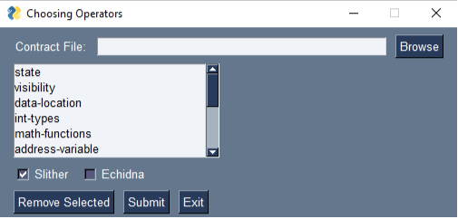

# Smart Contract Analyzer
## Instalation
In order to launch our software
```
https://github.com/maciejbobrek/Smart-Contract-Analyzer.git
```
```
python main.py
```
## Requirements
- [echidna](https://github.com/crytic/echidna)
- [slither](https://github.com/crytic/slither)

## About 

The goal of our project is to create a software that can perform mutation testing of a Smart Contract. First it creates AST - Mutation Testing tree. Then we kill mutants that have compliation errors and on the rest of them we perform testing using input.
The project is in development state. For now it produces AST tree with basic operators, and performs simple testing with silther or echidna

#### Input

- Ethereum Smart Contract
- n Tests or Slither Static Tests

#### Output

- Mutation Testing result in %

#### How Does it Work?

When you launch our software , a GUI opens where user can choose what mutation operators to use, and whether wants to use slither static testing or dynamic echidna tests from input.
To use echidna you need to have one class, with test methos after '//TESTS' flag. Example of that contract is in example_contracts/echidna.sol.


